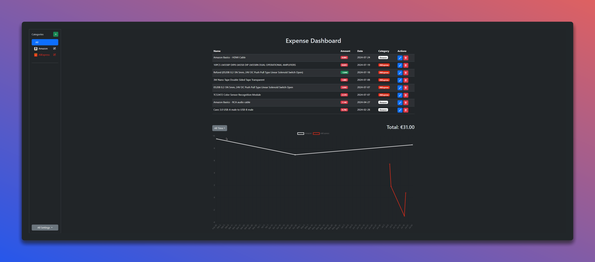

# 🏦 Expense Dashboard



[](https://github.com/EXELVI/expense_dashboard/stargazers)
[](https://github.com/EXELVI/expense_dashboard)
[](https://github.com/EXELVI/expense_dashboard/issues)
[](https://github.com/EXELVI/expense_dashboard/commits/main)

[](https://developer.mozilla.org/en-US/docs/Web/JavaScript)
[](https://developer.mozilla.org/en-US/docs/Web/HTML)
[](https://developer.mozilla.org/en-US/docs/Web/CSS)
[](https://getbootstrap.com/)

## 📊 Overview

**Expense Dashboard** is a web application that helps you track your expenses and visualize your spending. Built using HTML, CSS (Bootstrap), and JavaScript, this dashboard allows you to manage your expenses effectively and gain insights through graphical representations.

## 🚀 Features

- **Add Expenses**: Track your expenses with details like name, amount, and date.
- **Categorize Expenses**: Organize your expenses by categories.
- **Visualize Spending**: View charts representing your spending over time.
- **Responsive Design**: Mobile-friendly layout with Bootstrap.

## 🛠️ Installation

To get started with the Expense Dashboard, follow these steps:

1. **Clone the Repository**

    ```bash
    git clone https://github.com/EXELVI/expense_dashboard.git
    ```

2. **Navigate to the Project Directory**

    ```bash
    cd expense_dashboard
    ```

3. **Open `index.html` in Your Browser**

    Simply open `index.html` in your web browser to start using the dashboard.

## 🤝 Contributing

Contributions, issues, and feature requests are welcome! Feel free to check the [issues page](https://github.com/EXELVI/expense_dashboard/issues)!